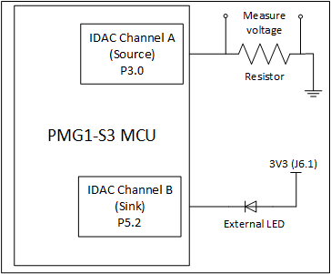
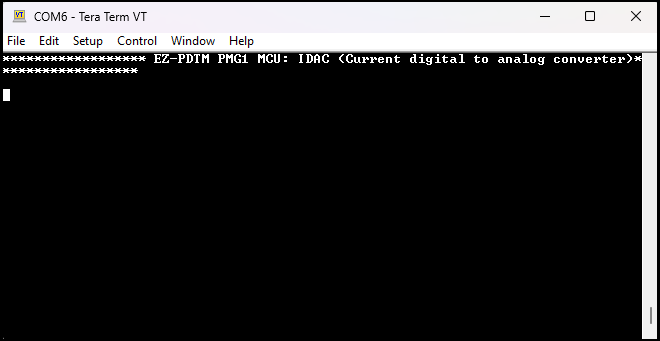
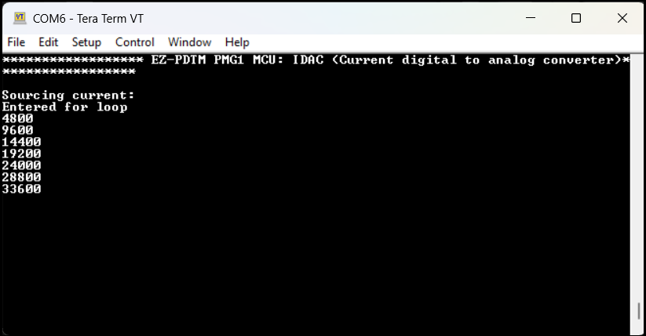
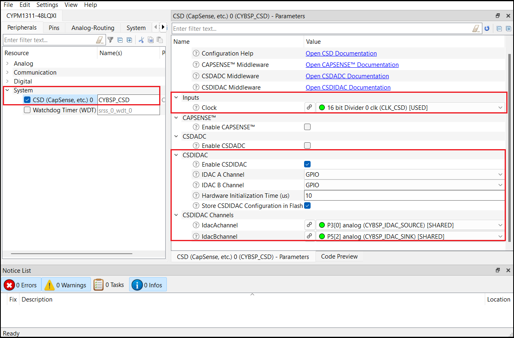
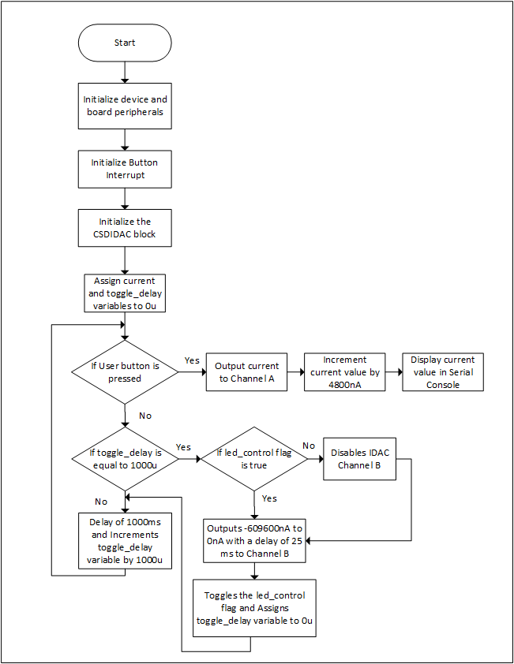

# EZ-PD&trade; PMG1 MCU: IDAC (Current output digital-to-analog converter)

This code example demonstrates the use of the CSD hardware block-based current digital-to-analog converter (CSDIDAC) of EZ-PD&trade; PMG1-S3 MCU as both a current source and a current sink. CSDIDAC supports two channels – A and B. Channel A is configured as a current source, where the current increases upon pressing a switch. Once the output reaches its maximum value, it resets to zero and starts increasing the current value again. The last current output value is maintained when the switch is not pressed. The UART displays the current value for which the CSDIDAC is configured. Channel B is configured as a current sink, and is used to increase the intensity of an LED from minimum to maximum.

[View this README on GitHub.](https://github.com/Infineon/mtb-example-pmg1-csdidac)

[Provide feedback on this code example.](https://cypress.co1.qualtrics.com/jfe/form/SV_1NTns53sK2yiljn?Q_EED=eyJVbmlxdWUgRG9jIElkIjoiQ0UyMzk1MjEiLCJTcGVjIE51bWJlciI6IjAwMi0zOTUyMSIsIkRvYyBUaXRsZSI6IkVaLVBEJnRyYWRlOyBQTUcxIE1DVTogSURBQyAoQ3VycmVudCBvdXRwdXQgZGlnaXRhbC10by1hbmFsb2cgY29udmVydGVyKSIsInJpZCI6Im5zaCIsIkRvYyB2ZXJzaW9uIjoiMS4wLjAiLCJEb2MgTGFuZ3VhZ2UiOiJFbmdsaXNoIiwiRG9jIERpdmlzaW9uIjoiTUNEIiwiRG9jIEJVIjoiV0lSRUQiLCJEb2MgRmFtaWx5IjoiVFlQRS1DIn0=)

## Requirements

- [ModusToolbox&trade;](https://www.infineon.com/modustoolbox) v3.1 or later (tested with v3.1)
- Board support package (BSP) minimum required version: 3.1.0
- Programming language: C
- Associated parts: [EZ-PD&trade; PMG1-S3 MCU](https://www.infineon.com/cms/en/product/universal-serial-bus/usb-c-high-voltage-microcontrollers/ez-pd-pmg1-s3-high-voltage-mcu-with-usb-c-pd)

## Supported toolchains (make variable 'TOOLCHAIN')

- GNU Arm&reg; Embedded Compiler v10.3.1 (`GCC_ARM`) – Default value of `TOOLCHAIN`
- Arm&reg; Compiler v6.16 (`ARM`)
- IAR C/C++ Compiler v9.30.1 (`IAR`)

## Supported kits (make variable 'TARGET')

-  [EZ-PD&trade; PMG1-S3 Prototyping Kit](https://www.infineon.com/CY7113) (`PMG1-CY7113`) – Default value of `TARGET`

## Hardware setup

This example uses the board's default configuration. See the kit user guide to ensure that the board is configured correctly.

1. Place a resistor between pin 'P3.0' and ground to measure the voltage across the resistor caused by the current output. Use Ohm's law to select the resistor *(V/I)*, where *V* is the maximum GPIO voltage (3.3 V), and *I* is the maximum current that CSDIDAC supports (609600 nA).

2. Connect an external LED between pin 'P5.2' and 3V3 (J6.1).

To change the CSDIDAC pin, refer to section [Enabling the CSDIDAC functionality](#enabling-the-csdidac-functionality).

> **Note:** Any GPIO pin can be configured for CSDIDAC functionality.

**Figure 1. Block diagram of hardware setup**



For kit version older than **CY7113 board revision 3 or lower**, connect the UART Tx (J6.10 to J3.8) and UART Rx (J6.9 to J3.10) lines to establish a UART connection between KitProg3 and the PMG1 device.

> **Note:** If UART `DEBUG_PRINT` messages are enabled, UART connection is needed. See [Compile-time configurations](#compile-time-configurations) for more details.

## Software setup

Install a terminal emulator if you do not have one. Instructions in this document use [Tera Term](https://teratermproject.github.io/index-en.html).

This example requires no additional software or tools.

> **Note:** If the `DEBUG_PRINT` macro is enabled, Tera Term is needed to view UART print messages.

## Using the code example

### Create the project 

The ModusToolbox&trade; tools package provides the Project Creator as both a GUI tool and a command line tool.

<details><summary><b>Use Project Creator GUI</b></summary>

1. Open the Project Creator GUI tool.

   There are several ways to do this, including launching it from the dashboard or from inside the Eclipse IDE. For more details, see the [Project Creator user guide](https://www.infineon.com/ModusToolboxProjectCreator) (locally available at *{ModusToolbox&trade; install directory}/tools_{version}/project-creator/docs/project-creator.pdf*).

2. On the **Choose Board Support Package (BSP)** page, select a kit supported by this code example. See [Supported kits](#supported-kits-make-variable-target).

   > **Note:** To use this code example for a kit not listed here, you may need to update the source files. If the kit does not have the required resources, the application may not work.

3. On the **Select Application** page:

   a. Select the **Applications(s) Root Path** and the **Target IDE**.

   > **Note:** Depending on how you open the Project Creator tool, these fields may be pre-selected for you.

   b.	Select this code example from the list by enabling its check box.

   > **Note:** You can narrow the list of displayed examples by typing in the filter box.

   c. (Optional) Change the suggested **New Application Name** and **New BSP Name**.

   d. Click **Create** to complete the application creation process.

</details>

<details><summary><b>Use Project Creator CLI</b></summary>

The 'project-creator-cli' tool can be used to create applications from a CLI terminal or from within batch files or shell scripts. This tool is available in the *{ModusToolbox&trade; install directory}/tools_{version}/project-creator/* directory.

Use a CLI terminal to invoke the 'project-creator-cli' tool. On Windows, use the command-line 'modus-shell' program provided in the ModusToolbox&trade; installation instead of a standard Windows command-line application. This shell provides access to all ModusToolbox&trade; tools. You can access it by typing "modus-shell" in the search box in the Windows menu. In Linux and macOS, you can use any terminal application.

The following example clones the "[IDAC (Current output digital-to-analog converter)](https://github.com/Infineon/mtb-example-pmg1-csdidac)" application with the desired name "MyIDAC" configured for the *PMG1-CY7113* BSP into the specified working directory, *C:/mtb_projects*:

   ```
 project-creator-cli --board-id PMG1-CY7113 --app-id mtb-example-pmg1-csdidac --user-app-name MyIDAC --target-dir "C:/mtb_projects"
   ```

The 'project-creator-cli' tool has the following arguments:

Argument | Description | Required/optional
---------|-------------|-----------
`--board-id` | Defined in the <id> field of the [BSP](https://github.com/Infineon?q=bsp-manifest&type=&language=&sort=) manifest | Required
`--app-id`   | Defined in the <id> field of the [CE](https://github.com/Infineon?q=ce-manifest&type=&language=&sort=) manifest | Required
`--target-dir`| Specify the directory in which the application is to be created if you prefer not to use the default current working directory | Optional
`--user-app-name`| Specify the name of the application if you prefer to have a name other than the example's default name | Optional

> **Note:** The project-creator-cli tool uses the `git clone` and `make getlibs` commands to fetch the repository and import the required libraries. For details, see the "Project creator tools" section of the [ModusToolbox&trade; tools package user guide](https://www.infineon.com/ModusToolboxUserGuide) (locally available at {ModusToolbox&trade; install directory}/docs_{version}/mtb_user_guide.pdf).

</details>

### Open the project

After the project has been created, you can open it in your preferred development environment.

<details><summary><b>Eclipse IDE</b></summary>

If you opened the Project Creator tool from the included Eclipse IDE, the project will open in Eclipse automatically.

For more details, see the [Eclipse IDE for ModusToolbox&trade; user guide](https://www.infineon.com/MTBEclipseIDEUserGuide) (locally available at *{ModusToolbox&trade; install directory}/docs_{version}/mt_ide_user_guide.pdf*).

</details>

<details><summary><b>Visual Studio (VS) Code</b></summary>

Launch VS Code manually, and then open the generated *{project-name}.code-workspace* file located in the project directory.

For more details, see the [Visual Studio Code for ModusToolbox&trade; user guide](https://www.infineon.com/MTBVSCodeUserGuide) (locally available at *{ModusToolbox&trade; install directory}/docs_{version}/mt_vscode_user_guide.pdf*).

</details>

<details><summary><b>Keil µVision</b></summary>

Double-click the generated *{project-name}.cprj* file to launch the Keil µVision IDE.

For more details, see the [Keil µVision for ModusToolbox&trade; user guide](https://www.infineon.com/MTBuVisionUserGuide) (locally available at *{ModusToolbox&trade; install directory}/docs_{version}/mt_uvision_user_guide.pdf*).

</details>


<details><summary><b>IAR Embedded Workbench</b></summary>

Open IAR Embedded Workbench manually, and create a new project. Then select the generated *{project-name}.ipcf* file located in the project directory.

For more details, see the [IAR Embedded Workbench for ModusToolbox&trade; user guide](https://www.infineon.com/MTBIARUserGuide) (locally available at *{ModusToolbox&trade; install directory}/docs_{version}/mt_iar_user_guide.pdf*).

</details>

<details><summary><b>Command line</b></summary>

If you prefer to use the CLI, open the appropriate terminal, and navigate to the project directory. On Windows, use the command-line 'modus-shell' program; on Linux and macOS, you can use any terminal application. From there, you can run various `make` commands.

For more details, see the [ModusToolbox&trade; tools package user guide](https://www.infineon.com/ModusToolboxUserGuide) (locally available at *{ModusToolbox&trade; install directory}/docs_{version}/mtb_user_guide.pdf*).

</details>

## Operation

1. Ensure that the steps listed in the [Hardware setup](#hardware-setup) section are completed.

2. Ensure that the jumper shunt on power selection jumper (J5) is placed at position 2-3 (VIN) to enable programming.

3. Connect the board to your PC using the USB Type-C (USB-C) cable through the KitProg3 USB-C port (J1).

4. Program the board using one of the following:
   <details><summary><b>Using Eclipse IDE</b></summary>

      1. Select the application project in the Project Explorer.

      2. In the **Quick Panel**, scroll down, and click **\<Application Name> Program (KitProg3_MiniProg4)**.
   </details>

   <details><summary><b>In other IDEs</b></summary>

   Follow the instructions in your preferred IDE.
   </details>

   <details><summary><b>Using CLI</b></summary>

     From the terminal, execute the `make program` command to build and program the application using the default toolchain to the default target. The default toolchain and target are specified in the application's Makefile but you can override these values manually:

      ```
      make program TOOLCHAIN=<toolchain>
      ```

      Example:
      ```
      make program TOOLCHAIN=GCC_ARM
      ```
   </details>

5. After programming the kit, disconnect the USB-C cable (J1) and change the position of the power selection jumper (J5) to 1-2 (VBUS).

6. If the `DEBUG_PRINT` macro is enabled, to see the UART messages, connect the USB-C cable back to the KitProg3 USB connector (J1) and open a serial console. Select the KitProg3 COM port and set the serial port parameters to '8N1' and '115200' baud.

7. Connect the USB-C cable to USB Power Delivery (USB PD) port (J10). The application starts automatically. If `DEBUG_PRINT` is enabled, confirm that the message "EZ-PD&trade; PMG1 MCU: IDAC (Current output digital-to-analog converter") is displayed in the serial console as shown in **Figure 2**.

   **Figure 2. `DEBUG_PRINT` enable confirmation message in the serial console**

   

8. IDAC as a current source:

	- IDAC channel A is configured as the current source with GPIO pin 'P3.0' (User button)

	- Press the User button (SW3). If `DEBUG_PRINT` is enabled, serial console displays the current value for which the IDAC channel A is configured, as shown in **Figure 3**

	- Calculate the current by measuring the voltage across the resistor connected between the IDAC GPIO pin (P3.0) and ground

	- **Figure 4** shows the corresponding voltage measured for the current (0 nA to 609600 nA)

   **Figure 3. Serial console output when User button is pressed**

   

   **Figure 4. Voltage graph**

   

9. IDAC as a current sink:

	- IDAC channel B is configured as the current sink with GPIO pin 'P5.2'

	- The intensity of the external LED will increase from minimum to maximum, and this process repeats in a loop

## Debugging

You can debug the example to step through the code.

<details><summary><b>In Eclipse IDE</b></summary>

Use the **\<Application Name> Debug (KitProg3_MiniProg4)** configuration in the **Quick Panel**. 
Ensure that the board is connected to your PC using the USB-C cables through both the KitProg3 USB-C connector, as well as the USB PD port, with the jumper shunt on power selection jumper (J5) placed at position 1-2.
For details, see the "Program and debug" section in the [Eclipse IDE for ModusToolbox&trade; user guide](https://www.infineon.com/MTBEclipseIDEUserGuide).

</details>

<details><summary><b>In other IDEs</b></summary>

Follow the instructions in your preferred IDE.
</details>

## Design and implementation

CSDIDAC supports two-channel (A and B) IDAC with 7-bit resolution. Configure both the channels independently for sourcing or sinking current. See [CSDIDAC middleware library](https://github.com/Infineon/csdidac) for more details. In this code example, Channel A is configured for sourcing current; firmware controls the current value. Channel B is configured for sinking current and is used for changing the intensity of the LED. The CSDIDAC could be configured by the ModusToolbox&trade; CSD personality.

See the [Configuration considerations](https://infineon.github.io/csdidac/csdidac_api_reference_manual/html/index.html#section_csdidac_configuration) section in the API reference guide for configuring the CSDIDAC.

### Enabling the CSDIDAC functionality

This section guides how to set up the CSDIDAC middleware for the CSDIDAC operation using ModusToolbox™.

1. Open **Device Configurator** under BSP Configurators.

2. In **Peripherals** tab, enable **CSD (Capsense, etc.)** peripheral under **System**, and give a name to the peripheral as shown in **Figure 5**.

3. Go to the **Parameters** pane and configure the CSD peripheral:

	- Under **Inputs**, assign any clock divider by using the Clock combo box. Clock value should be **48 MHz**.

	- Under **CSDIDAC**, mark the **Enable CSDIDAC** checkbox.

	- Enable both the IDAC channels ('IDAC A Channel' and 'IDAC B Channel') and set the output as **GPIO**.

	- Configure the CSDIDAC channels as shown in **Figure 5**.

      **Figure 5. CSDIDAC settings in Device Configurator**

      

4. Save and close the Device Configurator.

### Design

On start up of the EZ-PD&trade; PMG1-S3 MCU, the CSDIDAC block and Button interrupt is enabled.

- When User button is pressed, outputs the current value to Channel A. Serial console displays current value if `DEBUG_PRINT` is enabled.

- The intensity of the external LED increases from minimum to maximum using the GPIO output pin (P5.2) from IDAC channel B, which is configured as the IDAC current sink.

**Figure 6. Firmware flowchart**



## Compile-time configurations

The EZ-PD&trade; PMG1 MCU IDAC (Current output digital-to-analog converter) application functionality, can be customized through the compile-time parameters that can be turned ON/OFF through the *main.c* file.

 Macro name    |  Description     | Allowed values
 :-----------  | :-------------   | :-----------------
 `DEBUG_PRINT` | Debug print macro to enable UART print | '1u' to enable <br> '0u' to disable

### Resources and settings

**Table 1. Application resources**

 Resource    |  Alias/object     |    Purpose
 :---------  | :-------------    | :-------------
 UART (BSP)  | CYBSP_UART        | UART object used to send debug messages in serial console
 CSD (BSP)   | CYBSP_CSD         | CSD block used for IDAC channels A and B
 GPIO(BSP)   | CYBSP_IDAC_SINK   | GPIO pin to demonstrate the CSDIDAC as current sink
 GPIO (BSP)  | CYBSP_IDAC_SOURCE | GPIO pin to demonstrate the CSDIDAC as current source
 GPIO (BSP)  | CYBSP_USER_BTN    | GPIO pin used to increment current value by 4800 nA

<br>

## Related resources

Resources | Links
-----------|------------------
Application notes |[AN232553](https://www.infineon.com/AN232553) – Getting started with EZ-PD&trade; PMG1 MCU on ModusToolbox&trade; software <br>  [AN232565](https://www.infineon.com/an232565) – EZ-PD&trade; PMG1 hardware design guidelines and checklist
Code examples  | [Using ModusToolbox&trade;](https://github.com/Infineon/Code-Examples-for-ModusToolbox-Software) on GitHub
Device documentation | [EZ-PD&trade; PMG1 MCU datasheets](https://www.infineon.com/PMG1DS)
Development kits | Select your kits from the [Evaluation board finder](https://www.infineon.com/cms/en/design-support/finder-selection-tools/product-finder/evaluation-board).
Libraries on GitHub | [mtb-pdl-cat2](https://github.com/Infineon/mtb-pdl-cat2) – Peripheral Driver Library (PDL)
Tools  | [ModusToolbox&trade;](https://www.infineon.com/modustoolbox) – ModusToolbox&trade; software is a collection of easy-to-use libraries and tools enabling rapid development with Infineon MCUs for applications ranging from wireless and cloud-connected systems, edge AI/ML, embedded sense and control, to wired USB connectivity using PSoC&trade; Industrial/IoT MCUs, AIROC&trade; Wi-Fi and Bluetooth&reg; connectivity devices, XMC&trade; Industrial MCUs, and EZ-USB&trade;/EZ-PD&trade; wired connectivity controllers. ModusToolbox&trade; incorporates a comprehensive set of BSPs, HAL, libraries, configuration tools, and provides support for industry-standard IDEs to fast-track your embedded application development.

## Other resources

Infineon provides a wealth of data at [www.infineon.com](https://www.infineon.com) to help you select the right device, and quickly and effectively integrate it into your design.

## Document history

Document title: *CE239521* – *EZ-PD&trade; PMG1 MCU: IDAC (Current output digital-to-analog converter)*

 Version | Description of change
 ------- | ---------------------
 1.0.0   | New code example

<br>

All referenced product or service names and trademarks are the property of their respective owners.

The Bluetooth&reg; word mark and logos are registered trademarks owned by Bluetooth SIG, Inc., and any use of such marks by Infineon is under license.


---------------------------------------------------------

© Cypress Semiconductor Corporation, 2024. This document is the property of Cypress Semiconductor Corporation, an Infineon Technologies company, and its affiliates ("Cypress").  This document, including any software or firmware included or referenced in this document ("Software"), is owned by Cypress under the intellectual property laws and treaties of the United States and other countries worldwide.  Cypress reserves all rights under such laws and treaties and does not, except as specifically stated in this paragraph, grant any license under its patents, copyrights, trademarks, or other intellectual property rights.  If the Software is not accompanied by a license agreement and you do not otherwise have a written agreement with Cypress governing the use of the Software, then Cypress hereby grants you a personal, non-exclusive, nontransferable license (without the right to sublicense) (1) under its copyright rights in the Software (a) for Software provided in source code form, to modify and reproduce the Software solely for use with Cypress hardware products, only internally within your organization, and (b) to distribute the Software in binary code form externally to end users (either directly or indirectly through resellers and distributors), solely for use on Cypress hardware product units, and (2) under those claims of Cypress's patents that are infringed by the Software (as provided by Cypress, unmodified) to make, use, distribute, and import the Software solely for use with Cypress hardware products.  Any other use, reproduction, modification, translation, or compilation of the Software is prohibited.
<br>
TO THE EXTENT PERMITTED BY APPLICABLE LAW, CYPRESS MAKES NO WARRANTY OF ANY KIND, EXPRESS OR IMPLIED, WITH REGARD TO THIS DOCUMENT OR ANY SOFTWARE OR ACCOMPANYING HARDWARE, INCLUDING, BUT NOT LIMITED TO, THE IMPLIED WARRANTIES OF MERCHANTABILITY AND FITNESS FOR A PARTICULAR PURPOSE.  No computing device can be absolutely secure.  Therefore, despite security measures implemented in Cypress hardware or software products, Cypress shall have no liability arising out of any security breach, such as unauthorized access to or use of a Cypress product. CYPRESS DOES NOT REPRESENT, WARRANT, OR GUARANTEE THAT CYPRESS PRODUCTS, OR SYSTEMS CREATED USING CYPRESS PRODUCTS, WILL BE FREE FROM CORRUPTION, ATTACK, VIRUSES, INTERFERENCE, HACKING, DATA LOSS OR THEFT, OR OTHER SECURITY INTRUSION (collectively, "Security Breach").  Cypress disclaims any liability relating to any Security Breach, and you shall and hereby do release Cypress from any claim, damage, or other liability arising from any Security Breach.  In addition, the products described in these materials may contain design defects or errors known as errata which may cause the product to deviate from published specifications. To the extent permitted by applicable law, Cypress reserves the right to make changes to this document without further notice. Cypress does not assume any liability arising out of the application or use of any product or circuit described in this document. Any information provided in this document, including any sample design information or programming code, is provided only for reference purposes.  It is the responsibility of the user of this document to properly design, program, and test the functionality and safety of any application made of this information and any resulting product.  "High-Risk Device" means any device or system whose failure could cause personal injury, death, or property damage.  Examples of High-Risk Devices are weapons, nuclear installations, surgical implants, and other medical devices.  "Critical Component" means any component of a High-Risk Device whose failure to perform can be reasonably expected to cause, directly or indirectly, the failure of the High-Risk Device, or to affect its safety or effectiveness.  Cypress is not liable, in whole or in part, and you shall and hereby do release Cypress from any claim, damage, or other liability arising from any use of a Cypress product as a Critical Component in a High-Risk Device. You shall indemnify and hold Cypress, including its affiliates, and its directors, officers, employees, agents, distributors, and assigns harmless from and against all claims, costs, damages, and expenses, arising out of any claim, including claims for product liability, personal injury or death, or property damage arising from any use of a Cypress product as a Critical Component in a High-Risk Device. Cypress products are not intended or authorized for use as a Critical Component in any High-Risk Device except to the limited extent that (i) Cypress's published data sheet for the product explicitly states Cypress has qualified the product for use in a specific High-Risk Device, or (ii) Cypress has given you advance written authorization to use the product as a Critical Component in the specific High-Risk Device and you have signed a separate indemnification agreement.
<br>
Cypress, the Cypress logo, and combinations thereof, ModusToolbox, PSoC, CAPSENSE, EZ-USB, F-RAM, and TRAVEO are trademarks or registered trademarks of Cypress or a subsidiary of Cypress in the United States or in other countries. For a more complete list of Cypress trademarks, visit www.infineon.com. Other names and brands may be claimed as property of their respective owners.